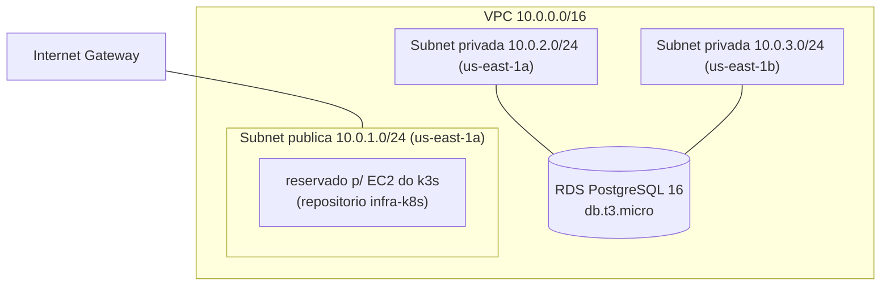

# oficina-mecanica-infra-db

Infraestrutura como código (Terraform) da camada de dados do projeto **OficinaMecanica** — Fase 3 do Tech Challenge (POS TECH/FIAP).

Repositório separado dos demais (app principal, infra do cluster k3s, Lambda de autenticação) porque é o único ponto de dependência real entre eles: repositório 2 (k3s) e repositório 1 (Lambda) referenciam a VPC criada aqui via `data source` (busca por tag), não via Terraform remote state — mantém os repositórios desacoplados (ver ADR 0002 em `OficinaMecanica/docs/`).

## O que este repositório cria

- 1 VPC dedicada (`10.0.0.0/16`), separada da VPC default da conta
- 1 subnet pública (reservada para o EC2 do k3s do repositório `oficina-mecanica-infra-k8s`)
- 2 subnets privadas (para o RDS, sem rota de saída à internet — sem NAT Gateway, custo evitado)
- 1 instância RDS PostgreSQL 16 (`db.t3.micro`, 20GB, single-AZ, não publicamente acessível)
- Security Group liberando a porta 5432 apenas para dentro da própria VPC



## Como rodar localmente

Pré-requisitos: Terraform >= 1.6, credenciais AWS válidas (AWS Academy Learner Lab: `aws configure` com access key/secret/session token da sessão ativa).

```bash
terraform init
terraform plan -var="db_username=..." -var="db_password=..."
terraform apply -var="db_username=..." -var="db_password=..."
```

## CI/CD

Workflow em `.github/workflows/terraform.yml`:
- **Pull Request para `main`**: roda `terraform fmt -check`, `terraform validate` e `terraform plan`, comentando o resultado do plano diretamente no PR.
- **Merge em `main`**: roda `terraform apply -auto-approve` contra a conta AWS real.

Secrets do repositório necessários: `AWS_ACCESS_KEY_ID`, `AWS_SECRET_ACCESS_KEY`, `AWS_SESSION_TOKEN`, `DB_USERNAME`, `DB_PASSWORD`.

**Observação sobre AWS Academy Learner Lab:** as credenciais são temporárias e expiram/rotacionam a cada sessão do laboratório — diferente de uma conta AWS "normal", não é possível manter o CI/CD 100% automático indefinidamente sem intervenção manual (atualizar os secrets do repositório com a sessão ativa antes de cada execução). Essa limitação está documentada como decisão consciente, não como falha de design (ver ADR correspondente em `OficinaMecanica/docs/`).

## State remoto

O state fica em um bucket S3 (`oficina-mecanica-tfstate-159157616728`), compartilhado com os outros repositórios Terraform do projeto, cada um com sua própria `key` (`db/terraform.tfstate` neste caso) — necessário porque os runners do GitHub Actions são efêmeros e não podem depender de state local entre execuções.
